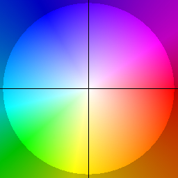
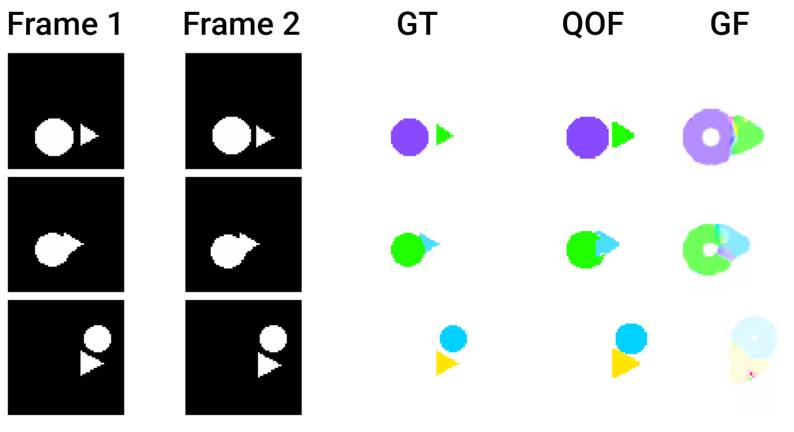

# Quantum Optical Flow
Project for Master Thesis in "Applied Computer Science, Machine Learning and Big Data" in University of Naples Parthenope.
The goal is to leverage Adiabatic Quantum Computing to solve the dense optical flow algorithm using Dwave Quantum Solvers.

## Usage
Type the following command in order to install the environment file
```
conda env create -f environment.yml
```

A D-Wave account is required when using a Quantum Hybrid Solver or a Quantum Solver. Simple tesing using a Simulated Annealing sampler does not require an account.

The two image frames or gif/videoclip are stored in the dataset folder. The chosen path is hard coded in utils/load_data.py.

demo.py contains code that can be used to perform:
- Dense optical flow between two frames
- Dense optical flow between two frames with parallilzation
- Block optical flow between two frames
- Block optical flow between two frames with parallelization

Where block optical flow considers a single pixel as a block of n pixels (e.g. 4, 16, 64... It's defaulted to 1). This block approach is preferred when working with bigger images.
The code defaults two image frames taken in input. In order to change it, "PERFORMING OPTICAL FLOW ON TWO FRAMES" should be commented out, while "PERFORMING OPTICAL FLOW ON GIF/VIDEO" should be uncommented. (respectively from line 152 to 197, and from 204 to 255)
Once everything is ready, the application can be run with the following command:
```
python demo.py -r L1 -d 1 -s 1 -a 0.5 -b 1 -l 2 -ta 1 -m c
```

Hyperparameters include:
- -r is the Regularization (L1, L2, and C for Charbonnier are available). Defaults to L1.
- -d is the maximum displacement of the optical flow. Defaults to 1.
- -s is the image scaling factor. Defaults to 1.
- -a is the alpha value of the energy function, which applies penalties. Defaults to 0.5.
- -b is the beta value of the energy function, which is used when computing Laplacian weights. Defaults to 7.5.
- -l is the lambda value of the energy function, which is multiplied to the second part of the function. Defaults to 2.
- -ta is the tao value of the energy functioSn, which is used as a threshold when computing regularization. Defaults to 1
- -m is the chosen mode for the BQM solving process. Its values are c for classic (it just uses Simulated Annealing), hq for Hybrid Quantum, and q for pure Quantum. Defaults to c.

Finally, pure quantum solver is recommended only when working with tiny images. Simulated Annaling or Quantum Hybrid Solver are the way to go.


## Results
Below are some results obtained from my thesis. The colorwheel for reference when converting optical flow vectors to color is the following
 
Results are great when working with simple shapes. 

Our algorithm was tested against Gunner Farneback's algorithm on simple geometry shapes. Here's a direct confrontation between the two approaches

 

Next, End Point Error and Angular Error from the aforementioned experiments are computed and analyzed.


## References
Dwave Sysyems:
https://www.dwavesys.com/

The project is inspired by this repository:
https://github.com/FarinaMatteo/qmmf

Energy function used:
https://arxiv.org/abs/1604.03513

Shape toy dataset used:
https://github.com/RahulSChand/Optical-Flow-Shape-Dataset

Pyqubo library used to compute QUBO more easily:
https://github.com/recruit-communications/pyqubo

## Acknowledgements
I am grateful to my supervisors, Professor Alessio Ferone and Professor Alessandra Rotundi, that proposed me this incredible work and supported me until the very final day before the presentation.
